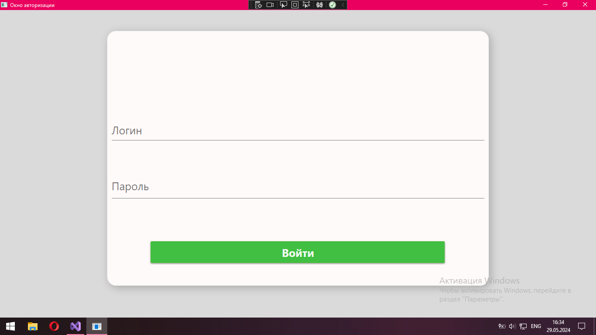
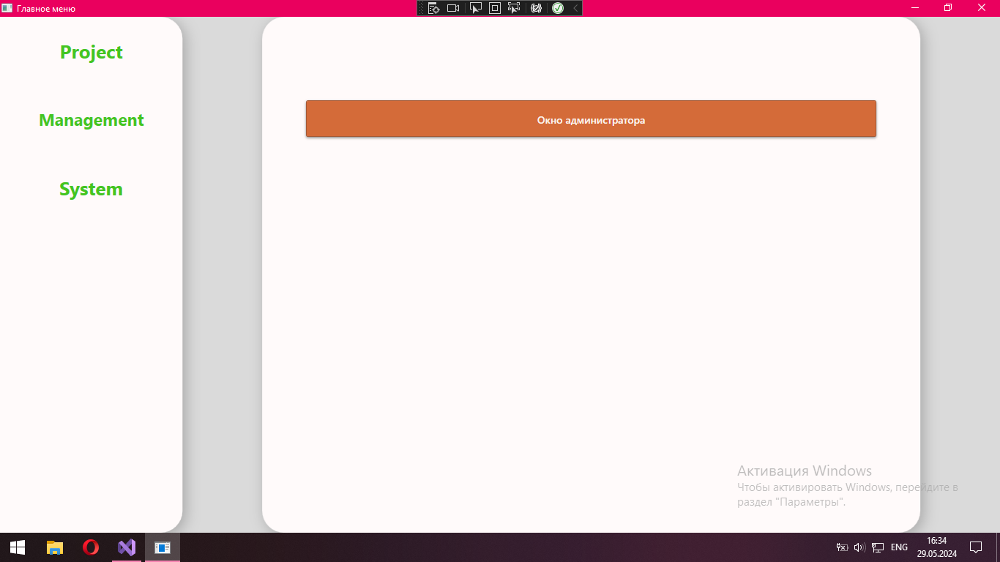
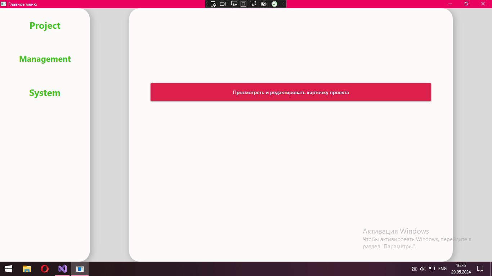
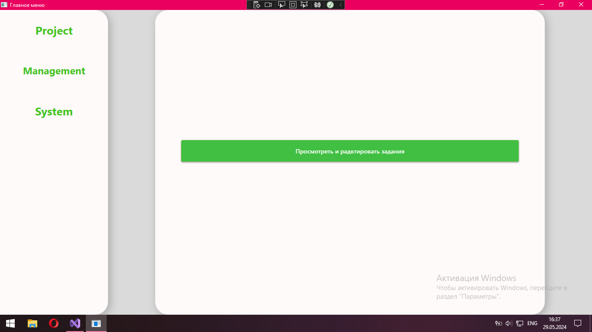
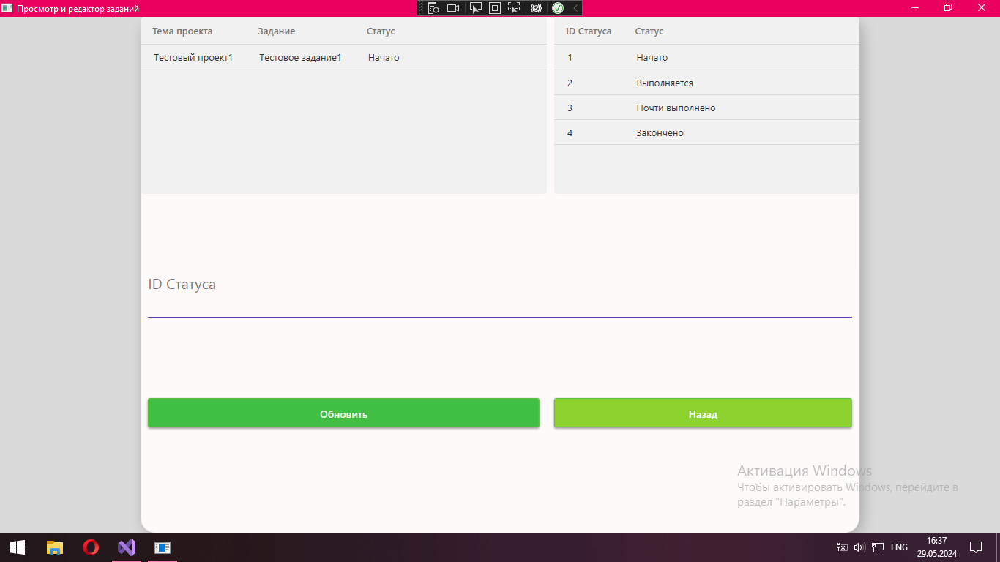
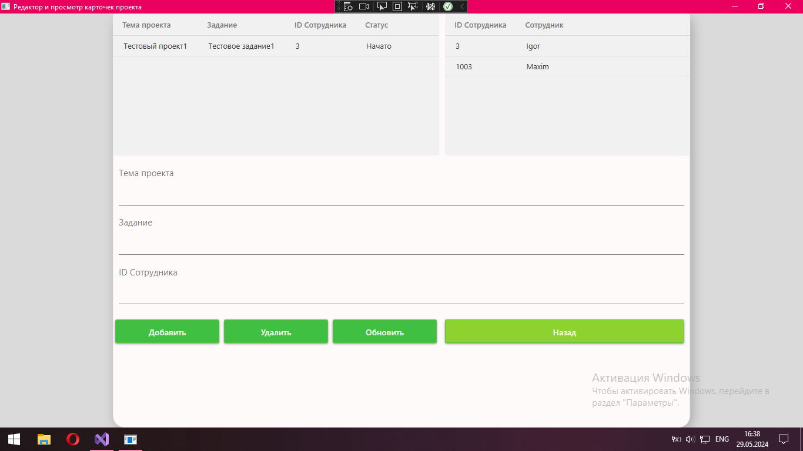
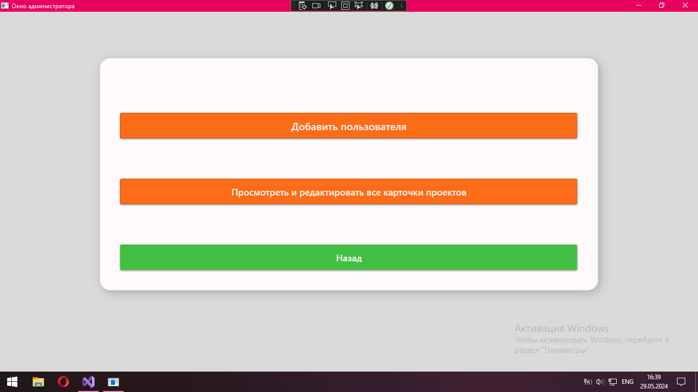
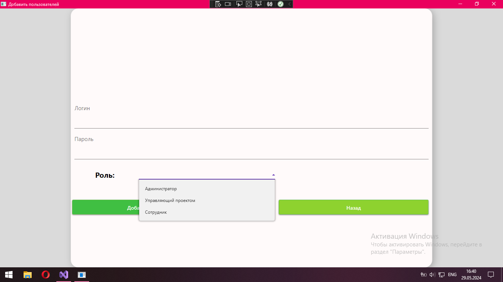
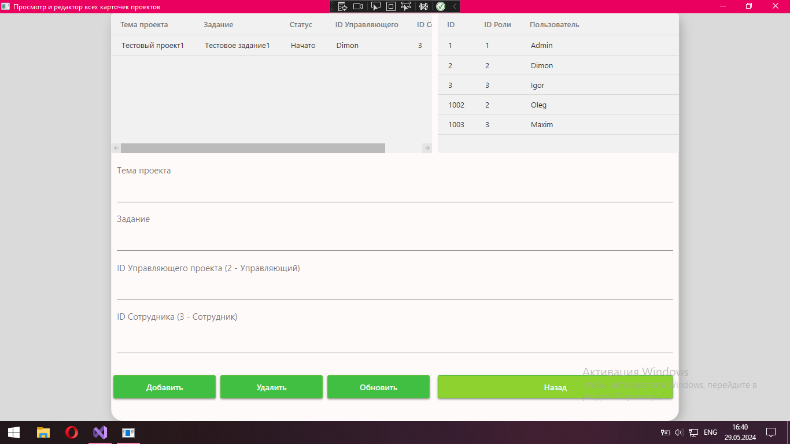

<h1 style="text-align:center;">ProjectManagementSystem</h1>
<h2 style="text-align:center;">“Система управления проектами”</h2>

<h3>Описание:</h3>

Данный проект представляет из себя приложение в котором пользователи в зависимости от совей роли могут управлять проектами.

Всего есть 3 роли:

<ul>
  <li>Администратор</li>
  <li>Управляющий проекта</li>
  <li>Сотрудник</li>
</ul>

В возможности адмистратора входят такие функции как:

<ul>
  <li>Доступ к окну администратора</li>
  <li>Добавление новых пользователей</li>
  <li>Добавление и редактирование карточек проекта</li>
</ul>

В возможности управляющего проекта входят такие функции как:

<ul>
  <li>Доступ к окну управляющего проекта</li>
  <li>Добавление и редактирование карточек проекта</li>
  <li>Назначение заданий для сотрудников</li>
</ul>

В возможности сотрудника входят такие функции как:

<ul>
  <li>Редактировать своё задание</li>
</ul>

<h3>В ходе создания проекта применялись такие технологии как:</h3>
<ul>
  <li>Язык программирования C#</li>
  <li>Среда разработки Visual Studio</li>
  <li>СУБД SQL Server Management Studio (SSMS)</li>
  <li>Язык разметки XAML</li>
  <li>Библиотека Material Design</li>
</ul>

<h3>Скриншоты проекта:</h3>
<figure>
	
	
Рисунок 1 - окно авторизации

</figure>
<figure>
	
	
Рисунок 2 - главное меню от лица администратора

</figure>
<figure>
	
	
Рисунок 3 - главное меню от лица управляющего проекта

</figure>
<figure>
	
	
Рисунок 4 - главное меню от лица сотрудника

</figure>
<figure>
	
	
Рисунок 5 - окно сотрудника

</figure>
<figure>
	
	
Рисунок 6 - окно управляющего проекта

</figure>
<figure>
	
	
Рисунок 7 - окно администратора

</figure>
<figure>
	
	
Рисунок 8 - окно добавления пользователей

</figure>
<figure>
	
	
Рисунок 9 - окно редактирования карточек проекта

</figure>

<h3>Видео демонстрация:</h3>
<h2>От лица администратора:</h2>
https://github.com/NecroDieMon/ProjectManagementSystem/assets/116455805/bd336e60-1576-4e9a-878f-0c248cf8b915
<h2>От лица управляющего проектом:</h2>
https://github.com/NecroDieMon/ProjectManagementSystem/assets/116455805/e4676d5b-22a8-4f70-9995-395ec4163dd7
<h2>От лица сотрудника:</h2>
https://github.com/NecroDieMon/ProjectManagementSystem/assets/116455805/eba4a7ea-1e94-4cdb-b47e-1ce4b1d6ad17
